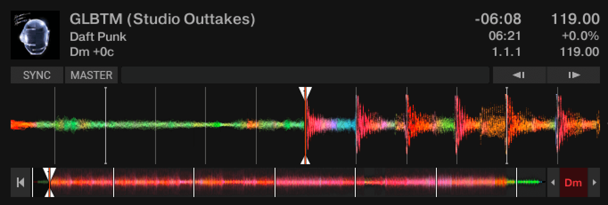
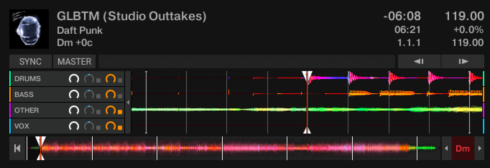
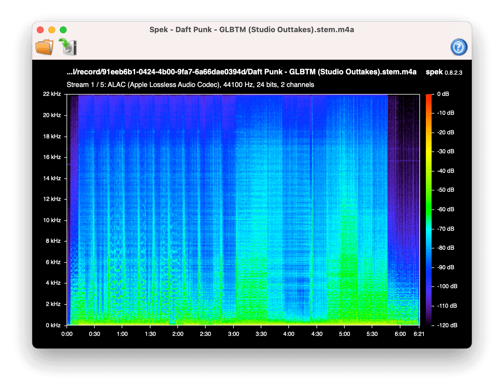

# 🎛 Stemgen

Stemgen is a Stem file generator. Convert any track into a Stem and have fun with Traktor.

A [Stem](https://www.native-instruments.com/en/specials/stems/) file is an open, multi-channel audio file that contains a track split into four musical elements – bass, drums, vocals, and melody, for example. With each element available independently, you have more control over the music you play.

Stemgen uses `demucs` to separate the 4 stems and `ni-stem` to create the Stem file.

Our new file contains four stems: bass, drums, vocals and other.

## Why?

> "It's no secret that I'm fully behind the approach to encourage individuality in creativity and for artists to play differently. Stems is a new format that mirrors my constant quest for spontaneity to drive the art of performance forwards. I hope that releasing my album [From My Mind To Yours](https://www.junodownload.com/products/richie-hawtin-from-my-mind-to-yours/3318751-02/) in this format, mastered by LANDR, inspires others to support the approach and bring even more flexibility to the art of DJing amongst its most progressive supporters." – Richie Hawtin

Stems are fun but nobody's releasing them. Stemgen is a way to create your own stems with only one command.

**May 2023 Update**: I saw François K last week in Paris at the Loft Babies party and I discovered
that he's playing with Stems. I highly recommend checking out his videos on YouTube: https://www.youtube.com/playlist?list=PLCr4LSsJFk48tmNoKn-l7mgsB5XUd2Af9.
He's a legend and a true pioneer. I'm so happy to see him having fun with Stems.
And trust me: it's even better in real life. Can't wait to see him again!

> "There is a really big difference between using a tool, a computer as a tool, to make it do specific things we want it to do, in the manner in which we want it to accomplish it. In most other situations, we all find ourselves dealing with a pre-programmed or pre-determined path that the software designer has decided we must use the software in order to get certain things done. And I think that makes it that we, little by little, become controlled by the path that was designed by the people who wrote the software and forced into these gullies that they created of usage, that this is how we are supposed to be doing things. And after a while I think it's making us forget who we were and what the essence of what the music was supposed to be about and really represented.
>
> And this right here -- I have to be honest -- it's groundbreaking to me in that sense. It's putting me back in touch with using these tools that I'm using right now as mere instruments of my will, rather than me being forced around the way they were designed to be operated, and in the process losing the very essence of what I was trying to express. Goddammit!" – François K, [Expansions (Live Stems Dub and Talk)](https://www.youtube.com/watch?v=jjZz0E8FuVs)

## What?

- **Highest quality**: ALAC stems by default, or AAC using the best encoder and quality possible.
- **Automatic metadata tagging**: scraping metadata from the master file and writing it back to the stem file.
- **Batching**: you can use this CLI to batch your stem creation and/or create a powerful workflow.
- **Universal**: works on macOS, Windows and Linux.

## Requirement

- python >= 3.9 https://www.python.org
- demucs v4 https://github.com/facebookresearch/demucs
- ffmpeg https://www.ffmpeg.org
- sox https://sox.sourceforge.net

## Usage

You can use `stemgen.py` to generate stems:

- `$ python3 stemgen.py -i track.wav`
- Have fun! Your new `.stem.m4a` file is in `output` dir
- Supported input file format are `.wav` `.wave` `.aif` `.aiff` `.flac`

## Bring your own stems

You can use `stem.py` to create stems:

- `$ python3 stem.py -i track/track.0.wav`
- You need to follow this naming convention: `[TRACK_NAME].[TRACK_NUMBER].[FILE_EXTENSION]`
- `TRACK_NAME` should be identical for all files
- Please use `0` as the `TRACK_NUMBER` for the master track. Example:
  `'track.0.wav'` for the master file then `'track.1.wav'` for the first stem, etc...
- Have fun! Your new `.stem.m4a` file is in `output` dir
- Supported input file format are `.wav` `.wave` `.aif` `.aiff` `.flac`

## Quick install on macOS

- `python3 -m pip install -U demucs`
- `brew install coreutils ffmpeg sox`

## Quick install on Linux

- `python3 -m pip install -U demucs`
- `sudo apt install ffmpeg sox` (or install ffmpeg with https://github.com/markus-perl/ffmpeg-build-script if you plan to encode in AAC)

## Long install on Windows

- `python3 -m pip install -U demucs`
- You might need Microsoft C++ Build Tools https://visualstudio.microsoft.com/visual-cpp-build-tools
  for Demucs
- Download ffmpeg from https://www.ffmpeg.org/download.html
- Download sox from https://sourceforge.net/projects/sox/files/sox
- Add ffmpeg and sox to your PATH

### qaac

If you plan to encode in AAC, you should install qaac. Here is a quick guide:

- Download qaac from https://github.com/nu774/qaac/releases
- Move the content of `x64` to `C:\Program Files\qaac` (or `x86` depending on your system)
- Add `C:\Program Files\qaac` to your PATH

Then, to use Audio Toolbox from Apple:

- `git clone https://github.com/nu774/makeportable.git`
- `cd makeportable`
- Download the iTunes installer from https://www.apple.com/itunes/download/win64
- Copy the iTunes installer to the `makeportable` folder
- `makeportable.cmd`
- Copy the newly created folder `QTfiles64` to your `C:\Program Files\qaac` folder

Then, to support FLAC files:

- Download FLAC from https://github.com/xiph/flac/releases
- Copy the `libFLAC.dll` file from the `Win64` folder (or `Win32` depending on your system)
- Paste it in your `C:\Program Files\qaac` folder

Enjoy! You can now encode AAC stems with Apple Audio Toolbox, the highest quality AAC encoder.

## Performance

- Stem and Stemgen supports 16-bit and 24-bit audio files!
- Stemgen needs to downsample the track to 44.1kHz to avoid problems with the separation software because the models are trained on 44.1kHz audio files.
- You may notice that the output file is pretty big. Apple Lossless Codec (ALAC) for audio encoding is used for lossless audio compression at the cost of increased file size.

## Disclaimer

If you plan to use Stemgen on copyrighted material, make sure you get proper authorization from right owners beforehand.

## License

MIT
